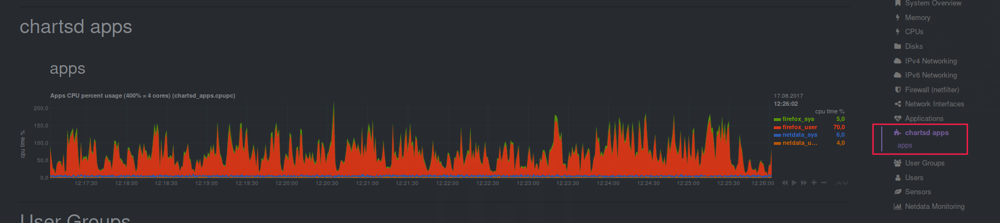

# Cpups_apps netdata plugin

Cpups_apps is a example plugin for [netdata](https://my-netdata.io) monitoring system.
It collects statistics of the processor usages as a percentage for the selected applications.

### Install

- [Install](https://github.com/firehol/netdata/wiki/Installation) netdata
- Copy cpupc_apps.chart.sh to ${NETDATA_INSTALL_PREFIX}/usr/libexec/netdata/charts.d/cpupc_apps.chart.sh
- Copy cpupc_apps.conf to ${NETDATA_INSTALL_PREFIX}/etc/netdata/charts.d/cpupc_apps.conf
- Edit the configuration (cpupc_apps.conf) by specifying the needed application
- Restart netdata

### Example

